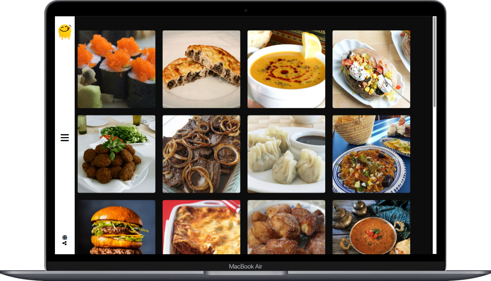
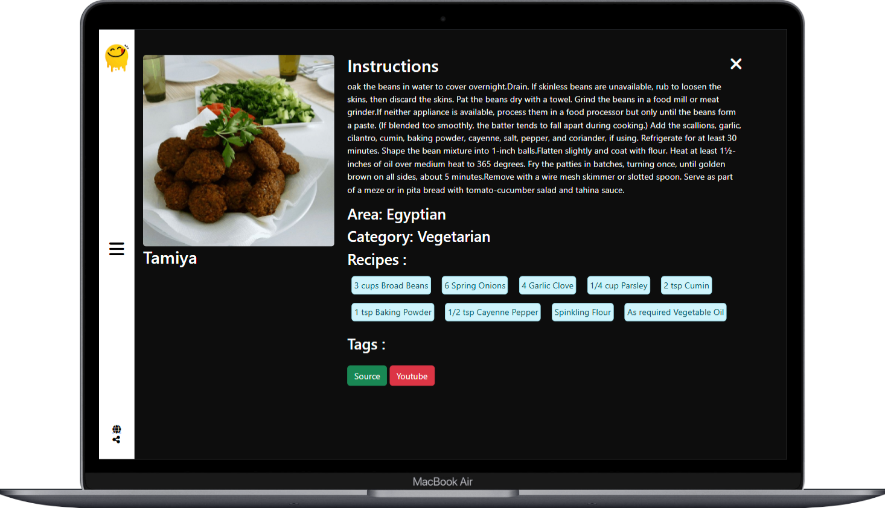

# Yummy App 🍲

**Yummy App** is a web app to explore, search, and find recipes. Browse by category or search to get inspired by new dishes!

## Features

- Browse recipes by category
- View detailed recipes with ingredients and instructions
- Search recipes by name or ingredient
- Responsive design for any device

## Technologies Used

- **HTML, CSS, JavaScript** for layout, styling, and functionality
- **Recipe API** integration for dynamic content

## Screenshots

### Home Page

### Recipe Details

## Usage

- Open the app, browse categories, or use the search bar to find recipes.
- Click on a recipe for ingredients and instructions.

